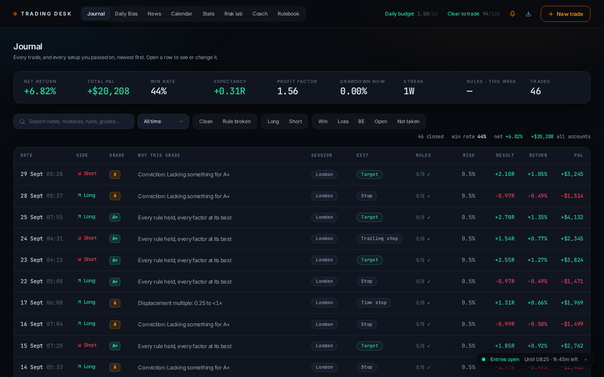
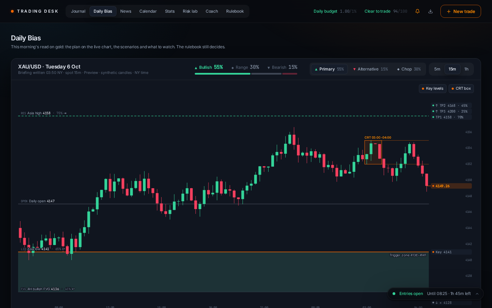
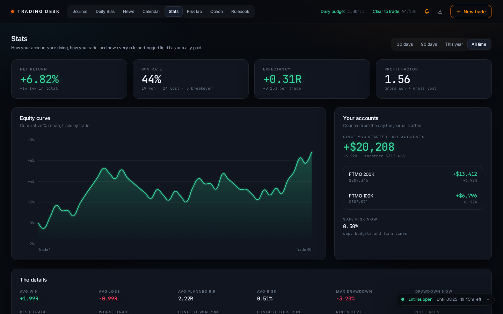
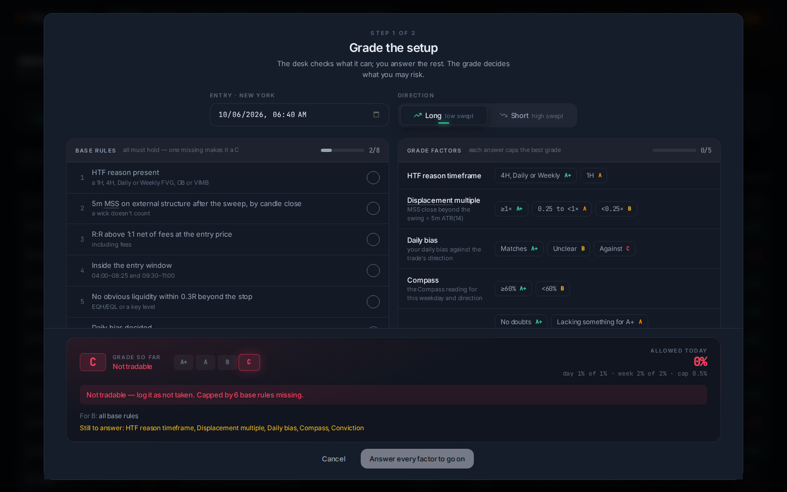
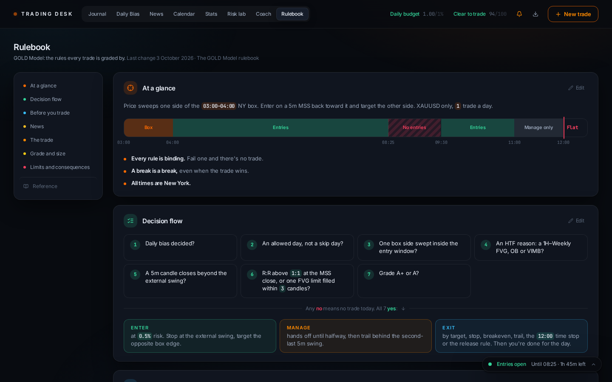
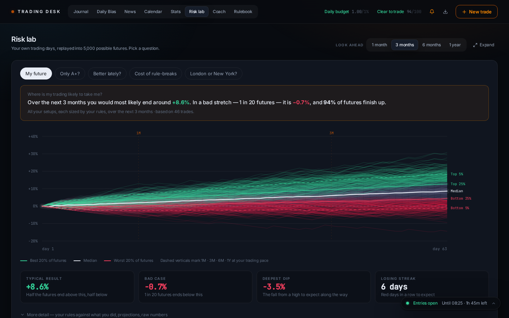
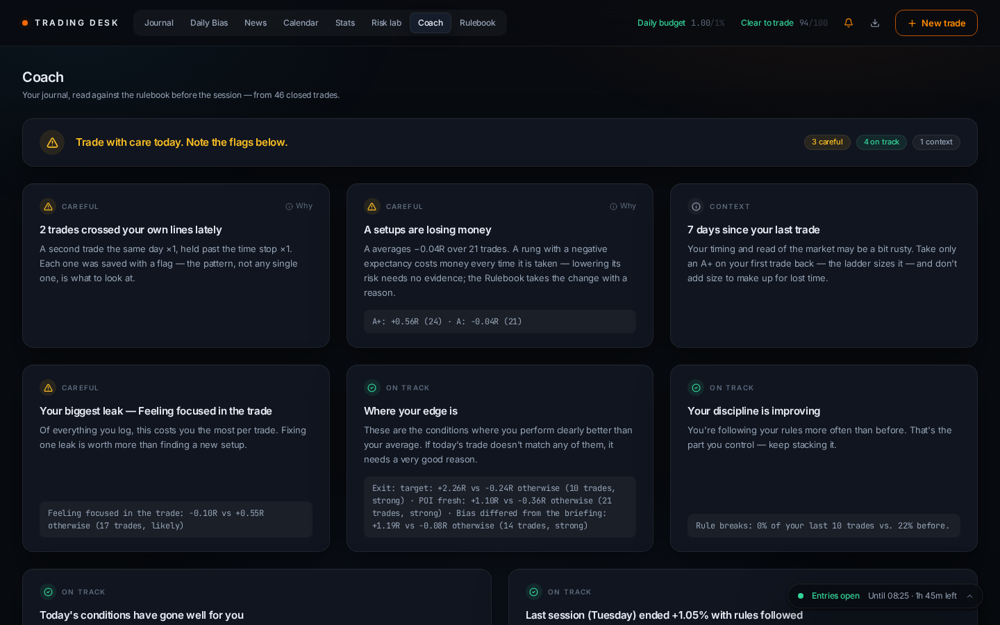

# Gucci Trade Journal

**A local trading desk for one strategy, the GOLD Model on XAUUSD. It keeps the journal, the rulebook and the discipline in one place.**



Most journals record trades. This one also knows the rules. Every setup is graded against the rulebook before it is taken, and the grade decides how much may be risked. Every rule the desk can check, it checks. Every broken rule is flagged and has a consequence. A morning check-in, a gold briefing and a coach turn your own history into advice for the next session.

It runs entirely on your Mac. There is no account, no cloud database and no API key. Your data is one SQLite file.

## What it does

**Before the session**
- **Check-in.** Nine questions about sleep, energy, focus, stress and pressure. The result is *Clear to trade*, *Trade with care* or *Better to leave the charts*. It is advice, not a lock: the choice to trade is always yours.
- **Daily Bias.** The morning's gold briefing drawn over the live price: scenarios, targets, key levels, the CRT box, the day's releases, macro drivers and analyst consensus. A cloud routine writes it, and the desk collects it from a Gmail draft.
- **News.** The economic calendar on New York time, with skip days and no-entry release windows marked.

**During the session**
- **Grade the setup.** Base rules first (the desk ticks the ones it can check), then five factors. The lowest cap wins, and the grade sets the risk. B and C are logged as *not taken*, with what they would have made.
- **Today dock.** Always in the corner: entry windows, release windows, skip days, days off, the daily and weekly budgets, and both accounts.

**After the session**
- **Journal and Calendar.** Every trade in R, % and dollars, with why it got its grade and which rules held.
- **Stats.** Equity, edges and leaks, habits after wins and losses, and every grade, factor answer and logged field compared against results.
- **Risk lab.** Your own trading days replayed into 5,000 possible futures, plus the Exit lab: which target would have paid best.
- **Coach.** A short read of the day: the rules' state, streaks, edges, leaks and hypotheses ready to decide.

**The rules themselves**
- **Rulebook.** The GOLD Model on one page, every number live and every section editable in place. Each change is saved with a one-line reason in the changelog, and a trade is always judged by the rules it was graded under.
- **One consequence.** Any broken rule costs the rest of that day and the next trading day.

## Two accounts

You log the dollar result of the main account (FTMO 200K). Linked accounts (FTMO 100K) take the same percentage on their own balance. The desk shows each account and the total, counted from the day the journal started. Names and balances are set in the Rulebook.

## Screenshots

| | |
|---|---|
|  |  |
| **Daily Bias** — the plan on the live chart | **Stats** — results, equity and your accounts |
|  |  |
| **New trade** — the setup graded before the trade | **Rulebook** — the rules, drawn and editable |
|  |  |
| **Risk lab** — 5,000 futures from your own days | **Coach** — the day's read, before the session |

*Screenshots use made-up example data.*

## Getting started

You need [Node.js](https://nodejs.org) (LTS) on macOS.

```bash
cd ~/Projects
git clone https://github.com/Gusta1919/Trading-desk.git
cd Trading-desk
npm install
npm start          # the desk on http://localhost:3847
```

On the first start the desk creates `data/trade-assistant.db` with the GOLD Model rulebook as version 1.0, and you're ready to trade. A database from an older version is moved whole into `data/archive/` (nothing is deleted), and your own check-ins come along.

To update later, close the desk, then run `git pull` and `npm install`, and start it again.

The Polish step-by-step guide, including the Dock app, a keyboard shortcut and the Gmail setup for the Daily Bias, is in [JAK-URUCHOMIC.txt](JAK-URUCHOMIC.txt).

## Commands

| Command | What it does |
|---|---|
| `npm start` | Starts the desk: the API on port 3848 and the page on port 3847 |
| `npm test` | Runs the test suite |
| `npm run build` | Type-checks and builds the page |
| `npm run reset` | With the desk closed: moves the database into `data/archive/` for an empty desk |
| `npm run preview:build` | Builds a static snapshot of the running desk into `dist-preview/` |

## Your data

- Everything lives in `data/trade-assistant.db` and is saved the moment you save.
- The download button in the header exports trades, check-ins and the rulebook with its changelog as one JSON file. Copying `data/` with the desk closed is a full backup.
- The only outside calls are read-only: the economic calendar and headlines, the gold price (Dukascopy's public feed) and, while today's briefing is missing, your own Gmail drafts folder.

## How it's built

- **Frontend:** React 19, Vite 7, Tailwind CSS 4. One dark theme, one type scale and shared components, so every tab looks and behaves the same way.
- **Backend:** Express 5 and better-sqlite3. The server re-derives R, risk, flags and allowed risk after every write, so the numbers are never stale.
- **Tests:** Node's built-in test runner, covering grading, discipline, the rulebook, the accounts, the database, the coach and the chart maths.

| Path | What it holds |
|---|---|
| `server/` | the API, the database (schema, archive, rulebook versions) and the news, candle and briefing feeds |
| `src/lib/goldModel.ts` | the GOLD Model rulebook as it ships |
| `src/lib/` | grading, discipline, budgets and accounts, news rules, stats, insights, coach, Risk lab |
| `src/components/` | the tabs, the trade form and the shared UI (`ui.tsx`) |
| `src/index.css` | the theme: colours, type scale, surfaces and animations |
| `tests/` | the test suite |
| `scripts/` | the Mac launcher, `reset` and the preview build |

---

Built for one trader and one strategy. Analysis, not financial advice.
